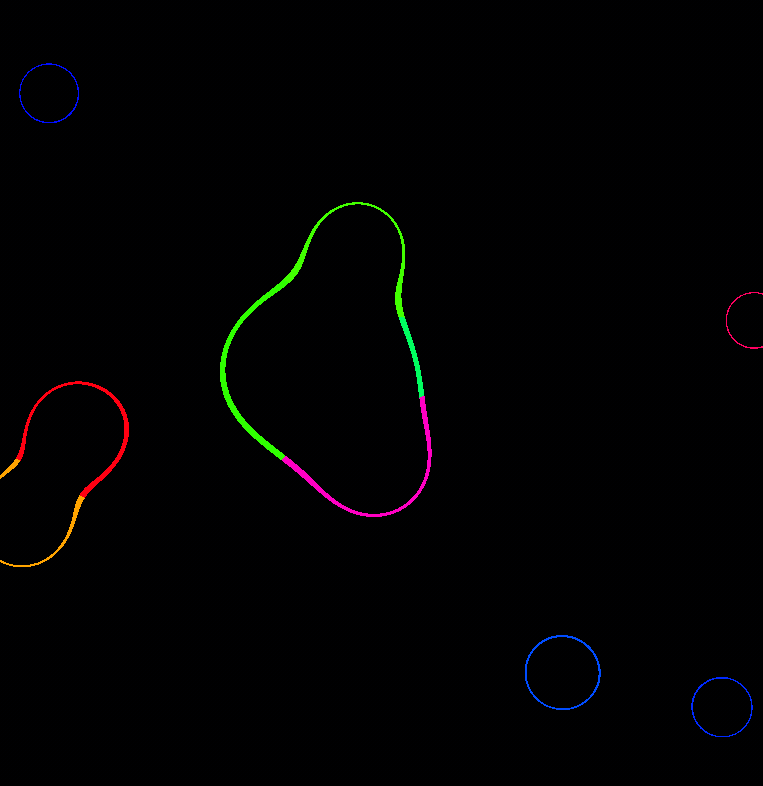

# Metaballs

## Introduction

Metaballs are organic looking n-dimensional objects. They are defined by a threshold value and a function that returns a value for any given point in space. The function is evaluated for each pixel in the screen and the pixel is colored based on the value returned by the function. The color of the pixel is determined by the distance of the point from the threshold value. The closer the point is to the threshold value, the brighter the pixel is. The farther the point is from the threshold value, the darker the pixel is.

## Installation

To run the simulation, simply clone the repository and open the `index.html` file in your browser. Alternatively, you can visit the [GitHub Pages](https://ghostscypher.github.io/metaballs/src/index.html) for this repository.

## Implementation

The implementation is done using shaders in WebGL. The threshold value is set to 1.0 and the function is defined in the fragment shader. The function is evaluated for each pixel in the screen and the pixel is colored based on the value returned by the function. The color of the pixel is determined by the distance of the point from the threshold value. The closer the point is to the threshold value, the brighter the pixel is. The farther the point is from the threshold value, the darker the pixel is.

## Demo

## References

1. [Metaballs](https://en.wikipedia.org/wiki/Metaballs)
2. [P5 JS](https://p5js.org/)
3. [P5 JS Reference](https://p5js.org/reference/)
4. [P5 JS Examples](https://p5js.org/examples/)
5. [P5 JS Web Editor](https://editor.p5js.org/)
6. [Coding train - P5 JS Tutorials](https://www.youtube.com/user/shiffman/playlists?view=50&sort=dd&shelf_id=14)
7. [The Nature of Code](https://natureofcode.com/)
8. [The Coding Train](https://thecodingtrain.com/)
9. [The Coding Train - Metaballs](https://www.youtube.com/watch?v=ccYLb7cLB1I)
10. [How computers draw weird-looking shapes - Reducible](https://www.youtube.com/watch?v=6oMZb3yP_H8&ab_channel=Reducible)
11. [Rainbow Metaballs](https://openprocessing.org/sketch/838276/)